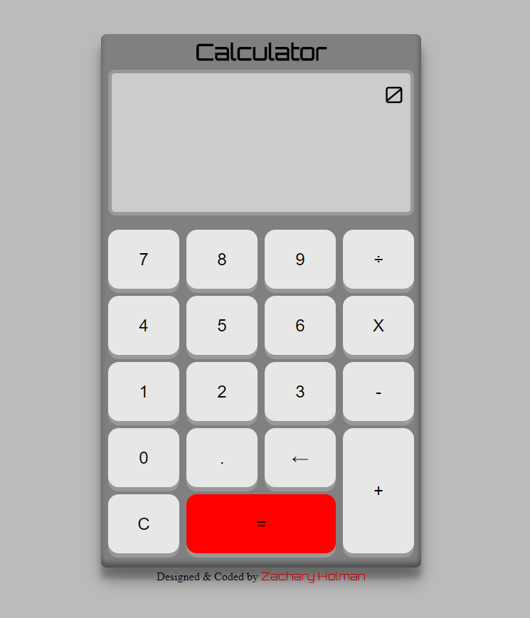

# JavaScript Calculator

A JavaScript calculator I have created while going through the advanced front end development project challenges at https://freeCodeCamp.com

## [JavaScript Calculator](https://github.com/Squibs/freeCodeCamp/tree/master/Front%20End%20Development%20Certification#javascript-calculator) (Go Back)

### [JavaScript Calculator](https://squibs.github.io/js-calculator/) (Click to view functional site)

<em>Completed August 1, 2017</em>

The first advanced advanced front end development project I have completed on freeCodeCamp. For this project I was tasked with creating a calculator that can perform simple functions (add, subtract, multiply, and divde) on two numbers. The ability to clear all inputs, and the ability to chain mathematical operations together until the equal button is pressed. I decided to do just this, however expand on it just a bit.

I have put in the ability to delete previously entered values to allow for anything entered to be changed. I put in the ability to switch mathmatical operations as soon as one is entered, without having to use the backspace. I made the calculator automatically enter in zeros at appropriate times, such as when typing in a decimal such as 0.5. I also even decided to give the calculator a bit of scientific value and gave it order of operations.

This project definitely can be expanded greatly and in the future I might just decide to expand on it. Overall I am quite happy with what I have created for this project and feel as though I have met the required "user stories" and more.

